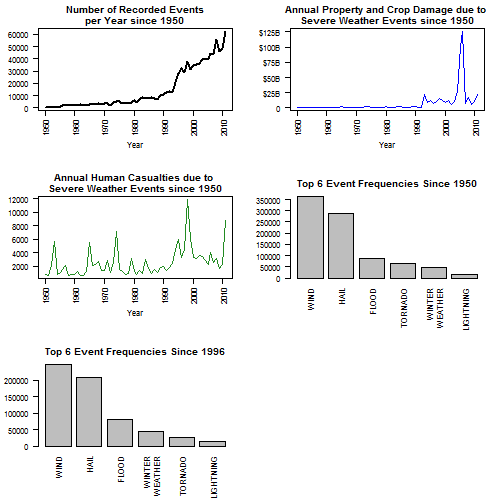
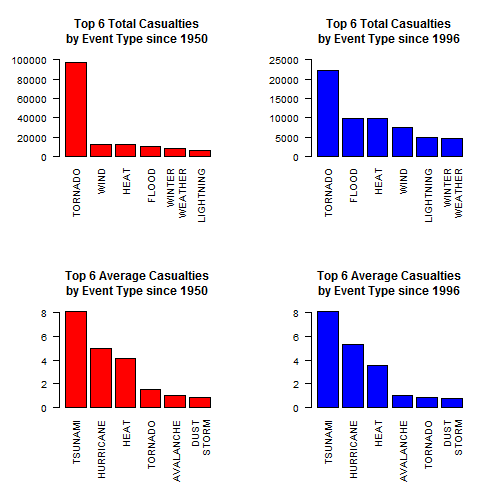
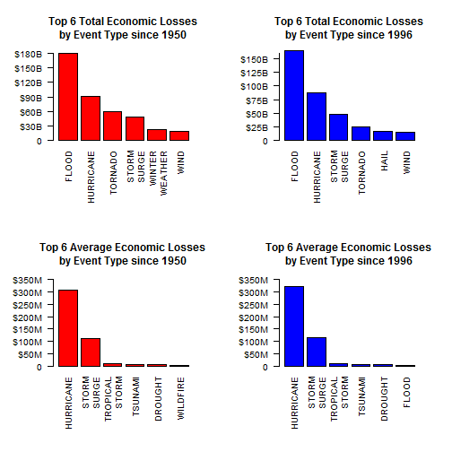

# Economic and Human Life Impacts of Severe U.S. Weather Events between 1950 and 2011
### Aaron Chandler
### July, 2015
====================================================================================


## **Synopsis**
=============

This analysis reviews the human and economic impacts severe weather events had in the US between 1950 and 2011. The findings distinguish between higher frequency cumulating effects and lower frequency high magnitude of impact effects. Tornados are responsible for the highest cumulative casualties, but only the fourth or fifth highest average casualties, depending on the time period being reviewed.  Extremely high temperatures emerge from the analysis of impacts on human life as particularly dangerous. Severe heat has the highest proportion of casualties that are fatalities, has had the highest single event number of fatalities, and is third highest casualties by aggregation and average.  

A similar story is told by reviewing the economic loss data for severe weather events.  Flooding has led to the highest aggregate economic loss, but has the lowest average of the top six event types after 1996 and isn't included in the top 6 averages of event types after 1950.  Coupled with the data showing flooding is one of the most common event types, this aggregation is due cumulative effects.  Hurricanes and storm surges substantially exceed the other event types by average, showing the high economic losses these relative lower frequency events cause.


## **Data Processing**
======================

### **Reading in the Data**
Data is read from the Coursera Reproducible Research webpage (link is in the analysis notes).  The data is reported by local officials including a narrative field, which contained commas.  Parsing the data by commas resulted in lost observations.  To address this issue, the data is read in twice: first, from the website, and then written out to the working directory created for downloading the file; second, from the csv file, but excluding columns not used in the analysis, such as the narrative column, providing a more usable data set.  Further transformations and scrubbing were required and are described below.


```r
dir <- getwd()
subdir <- "storm"

setInternet2(use = TRUE)

if (!file.exists(file.path(dir, subdir))) {
    dir.create(file.path(dir, subdir), mode = "0777")
}
# Read data from website
setwd(file.path(dir, subdir))
path <- file.path(getwd(), "storm.zip")
url <- ("https://d396qusza40orc.cloudfront.net/repdata%2Fdata%2FStormData.csv.bz2")
download.file(url, path)
con <- bzfile(path, "repdata_data_StormData.csv")
cols <- c("numeric", "character", "character", rep("NULL", 3), "character", 
    "character", rep("NULL", 12), "integer", rep("numeric", 4), "character", 
    "numeric", "character", rep("NULL", 9))
df <- read.csv(con, header = TRUE, stringsAsFactors = FALSE)
```


### **Transforming the Data**
The analysis required the following data transformations:

  1. Scrub the EVTYPE field
    + Reduce the dimensions of the NOAA's severe storm classifications from 48 events to 23
    + Classify misspelled,abbreviated, and mislabeled event types into one of the 23 events
  2. Transform property and crop damage fields into actual dollar amounts using the property and crop damage magnitude indicator field
  3. Define total economic loss column as the sum of the dollar value of property and crop damage
  4. Define casualty column as the sum of injuries and fatalities

#### **Description of the Transformations**

Scrubbing the EVTYPE field required analyst judgement to reduce the dimensions (e.g. classifying the listed event type) and treatment of mislabeled and misspelled event types.  To reduce the dimensions like event-types were collapsed in a broader category (e.g. thunderstorm wind and heavy wind into "wind").  The category with the most events rolled into it is "winter weather" with 10 NOAA event types described by the analyst defined grouping.  

Initial review of the data resulted in over 980 unique event types, whereas the Storm Database documentation creates the expectation of there being only about 50 event types being in the dataset.  Visual inspection of the unique event types included in the EVTYPE field using the View() function allowed for each category to be properly specified and then re-categorized into one of the 23 categories.  Where the EVTYPE field had unrecognizable labeling, the observation was assigned blank value.  To facilitate the re-categorization of event types, the analysis uses an additional csv file containing the original unique event types and the re-categorized event types.  The EVTYPE field in the working data set is matched with the de-duped EVTYPE column in the "reclass" csv file to bring in the column of associated re-categorized event types.

Both the re-class csv, which contains the de-duped actual values from the EVTYPE and the analyst defined categories, and the list associating the NOAA event types to the analyst defined event categories are available at [link](https://github.com/achandle13/Repro_PeerAssessment2).  A full list of the analyst defined categories is included in the analysis notes at the end of this report.  

The second transformation uses the definition of the damage magnitude indicator field described by the Storm Events Database documentation.  Where the character was "B" or "b" for the value of PROPDMGEXP or CROPDMGEXP, PROPDMG and CROPDMG were multiplied by 1 billion; where "M" or "m" was used the multiplier of 1 million was used; and where "K" or "k" was used 1000 was the multiplier.  Where the character supplied did not match an indicator described the database documentation, 0 was used. This produced dollar estimates that would be summed to produce the total economic loss column (transformation 3 in the list above).  No additional transformation was necessary to produce the casualty column.


```r
# Write out data set to be re-read back in with fewer columns
write.csv(df, "storm.csv", row.names = FALSE)
rm(df)
df <- read.csv("storm.csv", header = TRUE, stringsAsFactors = FALSE, colClasses = cols)

# Scrub event type field and reduce the dimensions included in the event
# type field. Data frame is cached in the knitr program.
df$reclass <- df$EVTYPE
rc <- read.csv("C:\\Users\\Anthony\\Documents\\storm\\reclass.csv", 
    header = TRUE, stringsAsFactors = FALSE)
v <- rc$EVENT[match(df$reclass, rc$ETYPE)]
v <- as.data.frame(v)
colnames(v) <- "event"
v$event <- as.character(v$event)
df <- cbind(df, v)

# Scrub Property Damage Value Field and Convert Property Damage Field to
# Actual Dollars
df$pcon <- df$PROPDMGEXP
df$pcon[which(df$PROPDMGEXP == "B" | df$PROPDMGEXP == "b")] <- 1e+09
df$pcon[which(df$PROPDMGEXP == "M" | df$PROPDMGEXP == "m")] <- 1e+06
df$pcon[which(df$PROPDMGEXP == "K" | df$PROPDMGEXP == "k")] <- 1000
df$pcon[which(df$PROPDMGEXP != "B" & df$PROPDMGEXP != "b" & df$PROPDMGEXP != 
    "M" & df$PROPDMGEXP != "m" & df$PROPDMGEXP != "k" & df$PROPDMGEXP != "K")] <- 0
df$pcon <- as.numeric(df$pcon)
df$prop <- df$PROPDMG * df$pcon

# Scrub Crop Damage Value Field and Convert Crop Damage Field to Actual
# Dollars
df$ccon <- df$CROPDMGEXP
df$ccon[which(df$CROPDMGEXP == "B" | df$CROPDMGEXP == "b")] <- 1e+09
df$ccon[which(df$CROPDMGEXP == "M" | df$CROPDMGEXP == "m")] <- 1e+06
df$ccon[which(df$CROPDMGEXP == "K" | df$CROPDMGEXP == "k")] <- 1000
df$ccon[which(df$CROPDMGEXP != "B" & df$CROPDMGEXP != "b" & df$CROPDMGEXP != 
    "M" & df$CROPDMGEXP != "m" & df$CROPDMGEXP != "k" & df$CROPDMGEXP != "K")] <- 0
df$ccon <- as.numeric(df$ccon)
df$crop <- df$CROPDMG * df$ccon

# Define new columns for later use in analysis
df$year <- format(as.Date(df$BGN_DATE, "%m/%d/%Y"), "%Y")
df$econLoss <- df$prop + df$crop
df$casualties <- df$FATALITIES + df$INJURIES
```


```r
eventYears <- table(df$year)
econLoss <- aggregate(econLoss ~ year, FUN = "sum", data = df, na.rm = TRUE)
humanLoss <- aggregate(casualties ~ year, FUN = "sum", data = df, na.rm = TRUE)
types <- table(df$event)
types <- as.data.frame(types)
types$Var1 <- as.character(types$Var1)
types <- types[order(-types$Freq), ]
colnames(types) <- c("Event", "Number")
types2 <- types[1:6, ]
labs <- types2$Event

events <- table(df$event[which(df$year >= 1996)])
events <- as.data.frame(events)
events$Var1 <- as.character(events$Var1)
colnames(events) <- c("Event", "Number")
events <- events[order(-events$Number), ]
```


```r
# Wrap function; function is used to make nice graphs;
wrap.it <- function(x, len) {
    sapply(x, function(y) paste(strwrap(y, len), collapse = "\n"), USE.NAMES = FALSE)
}


wrap.labels <- function(x, len) {
    if (is.list(x)) {
        lapply(x, wrap.it, len)
    } else {
        wrap.it(x, len)
    }
}

```


## **Results**
==============

### **Exploratory Analysis**
============================

Exploratory analysis shows the number of recorded events has increased over time (panel plot below, figure top left). The large spike in recorded events after 1996 is due to NOAA's decision to expand the number of recorded events to 48 from 3 (tornado, thunderstorm wind, and hail). Between 1950 and 1955 only tornados were recorded in the database. There was a slight upward trend in recorded events between 1955 and 1996. How much of the trend is attributed to the improved technology, communication, and standardized recording methods, and how much of it is attributed to increased frequency of severe weather is uncertain.  This uncertainty extends to the more pronounced upward trend in severe weather frequency after 1996.

The panel plot figures top right and middle left show the total annual economic loss and human causualties due to severe weather. Economic loss was relatively stable up until a spike in the early 90's (Hurricane Andrew).  Thereafter, economic loss was more volatile year over year compared to before 1992, with a huge spike in the mid-2000's due to the Mississippi River flooding and Hurricane Katrina.  The middle right and bottom left show the most frequent event types overall and after 1996.  In both cases wind storm events, hail, and flooding are the top three, with wind storm events being the most frequent.  


```r
options(scipen = 999)
par(mfrow = c(3, 2), mar = c(6, 4, 3, 2))

# Events per year
plot(eventYears, type = "l", main = "Number of Recorded Events\nper Year since 1950", 
    ylab = "", xlab = "Year", xaxt = "n", yaxt = "n")
axis(1, las = 2)
axis(2, las = 2)

# Economic Loss per year
plot(econLoss, type = "l", col = "blue", main = "Annual Property and Crop Damage due to \nSevere Weather Events since 1950", 
    xlab = "Year", ylab = "", yaxt = "n", xaxt = "n")
axis(1, las = 2)
axis(2, at = c(0, 2.5e+10, 5e+10, 7.5e+10, 1e+11, 1.25e+11), labels = c(0, "$25B", 
    "$50B", "$75B", "$100B", "$125B"), las = 2)

# Human Loss per Year
plot(humanLoss, type = "l", col = "forestgreen", main = "Annual Human Casualties due to \nSevere Weather Events since 1950", 
    xlab = "Year", ylab = "", yaxt = "n", xaxt = "n")
axis(1, las = 2)
axis(2, las = 2)

# Most Frequently Recorded Event since 1950
par(las = 2)
barplot(types2$Number, main = "Top 6 Event Frequencies Since 1950", names.arg = wrap.labels(labs, 
    10))

# Most Frequently Recorded Event since 1996
par(las = 2)
barplot(events$Number[1:6], main = "Top 6 Event Frequencies Since 1996", names.arg = wrap.labels(events$Event[1:6], 
    10))
```

 


### **Weather Events Having the Greatest Impact on Human Life**
================================================================

Analysis of severe weather events occurs across three dimensions: highest single event impacts measured by reported injuries, fatalities, and total casualties; the aggregated reported injuries, fatalities, and casualties for each event type for the entire reporting time period and after 1996; and the average casualties for each event over both time periods being considered.  

The next set of tables show the events with the highest single event impacts on human life.  

#### **Maximum Recorded Number of Fatalities, its Associated Event Type, and Year:**

A 1995 heat event (e.g. extremely high temperatures) led to 583 fatalities, the highest amount ever reported for a severe weather event.


```r
max(df$FATALITIES)
```

```
## [1] 583
```

```r
df$event[df$FATALITIES == max(df$FATALITIES)]
```

```
## [1] "HEAT"
```

```r
df$year[df$FATALITIES == max(df$FATALITIES)]
```

```
## [1] "1995"
```


#### **Maximum Recorded Number of Injuries, its Associated Event Type, and Year:**

In 1979, a tornado led to 1742 casualties, 1700 of which were injuries.  Both of these numbers are the highest reported amounts for all severe weather events.


```r
max(df$INJURIES)
```

```
## [1] 1700
```

```r
df$event[df$INJURIES == max(df$INJURIES)]
```

```
## [1] "TORNADO"
```

```r
df$year[df$INJURIES == max(df$INJURIES)]
```

```
## [1] "1979"
```


#### **Maximum Recorded Number of Casualties, its Associated Event Type, and Year:**

```r
max(df$casualties)
```

```
## [1] 1742
```

```r
df$event[df$casualties == max(df$casualties)]
```

```
## [1] "TORNADO"
```

```r
df$year[df$casualties == max(df$casualties)]
```

```
## [1] "1979"
```


```r
# Total Casualties by Event Type Historical
cas <- aggregate(cbind(INJURIES, FATALITIES, casualties) ~ event, data = df, 
    FUN = "sum")
cas <- cas[order(-cas$casualties), ]

# Total Casualties by Event Type after 1996
cas1996 <- aggregate(cbind(INJURIES, FATALITIES, casualties) ~ event, data = df[which(df$year >= 
    1996), ], FUN = "sum")
cas1996 <- cas1996[order(-cas1996$casualties), ]

# Average Casualties by Event Type Historical
avgcas <- aggregate(cbind(INJURIES, FATALITIES, casualties) ~ event, data = df, 
    FUN = mean, na.rm = TRUE)
avgcas <- avgcas[order(-avgcas$casualties), ]

# Average Casualties by Event Type after 1996
avg1996 <- aggregate(cbind(INJURIES, FATALITIES, casualties) ~ event, data = df[which(df$year >= 
    1996), ], FUN = mean, na.rm = TRUE)
avg1996 <- avg1996[order(-avg1996$casualties), ]
```


#### **Highest Total Casualties by Event since 1950**

Tornados have the highest total casualties, made up mostly by injuries. Heat (extremely high temperatures), however, has accounted for the most fatalities since 1950 despite only being officially recorded after 1996.  Heat is the most deadly severe weather event with 26% of casualties being fatalities.


```r
print(head(cas), row.names = FALSE)
```

```
##           event INJURIES FATALITIES casualties
##         TORNADO    91436       5664      97100
##            WIND    11442       1173      12615
##            HEAT     9243       3178      12421
##           FLOOD     8681       1554      10235
##  WINTER WEATHER     6729       1138       7867
##       LIGHTNING     5232        817       6049
```


#### **Highest Total Casualties by Event since 1996**

Reviewing events that were recorded after 1996, where records are more complete, shows tornados still have the highest number of casualties.  The top six events by casualties are the same compared to the previous view.  For some events the order has change.  Heat events  remain the deadliest, while tornados  have more than twice the number of casualties than the next closest weather event.


```r
print(head(cas1996), row.names = FALSE)
```

```
##           event INJURIES FATALITIES casualties
##         TORNADO    20669       1513      22182
##           FLOOD     8520       1337       9857
##            HEAT     7702       2036       9738
##            WIND     6697        785       7482
##       LIGHTNING     4141        651       4792
##  WINTER WEATHER     3741        933       4674
```


#### **Highest Average Casualties by Event since 1950**

Over both time views, tsunamis had the highest average casualties, injuries, and fatalities per recording of the event.  Hurricanes were second.  Third by average casualties is extreme heat.  Tornados also show up in both views.  


```r
print(head(avgcas), row.names = FALSE)
```

```
##       event INJURIES FATALITIES casualties
##     TSUNAMI   6.4500    1.65000     8.1000
##   HURRICANE   4.4966    0.45608     4.9527
##        HEAT   3.0738    1.05687     4.1307
##     TORNADO   1.4165    0.08774     1.5042
##   AVALANCHE   0.4393    0.58140     1.0207
##  DUST STORM   0.8200    0.04075     0.8608
```


#### **Highest Average Casualties by Event since 1996**

```r
print(head(avg1996), row.names = FALSE)
```

```
##       event INJURIES FATALITIES casualties
##     TSUNAMI   6.4500    1.65000     8.1000
##   HURRICANE   4.9004    0.46125     5.3616
##        HEAT   2.8099    0.74279     3.5527
##   AVALANCHE   0.4127    0.58995     1.0026
##     TORNADO   0.7785    0.05699     0.8355
##  DUST STORM   0.7424    0.02326     0.7657
```


#### **Plots of Historical and Average Historical Casualties**
==============================================================

The plots below visualize the total and average casualties by event.  The top left figure shows the extent of the impact tornados have had on human life in the US. Comparing events' impacts from this chart however is useful given the lack of reporting for the last four event types.  The top right figure shows that casualties from heat and flood exceed those of wind storms despite wind storm having been recorded since 1955. The graphs in the bottom row show the high impact of the lower frequency events.  Heat stands out as being more dangerous than tornados because an average casualties nearly two times that of tornados.  The interesting finding from these charts is the high impact heat has on human life, both in aggregate terms and on average.


```r
# plot figures showing human loss
par(mfrow = c(2, 2), las = 2, mar = c(8, 5, 5, 3))

# Historical Casualties by Event since 1950
barplot(cas$casualties[1:6], names.arg = wrap.labels(cas$event[1:6], 5), col = "red", 
    main = "Top 6 Total Casualties\nby Event Type since 1950", ylim = c(0, 
        100000))

# Historical Casualtiesby Event since 1996
barplot(cas1996$casualties[1:6], names.arg = wrap.labels(cas1996$event[1:6], 
    5), col = "blue", main = "Top 6 Total Casualties\nby Event Type since 1996", 
    ylim = c(0, 25000))

# Average Casualties by Event since 1950
barplot(avgcas$casualties[1:6], names.arg = wrap.labels(avgcas$event[1:6], 5), 
    col = "red", main = "Top 6 Average Casualties\nby Event Type since 1950")

# Average Casualties by Event since 1996
barplot(avg1996$casualties[1:6], names.arg = wrap.labels(avg1996$event[1:6], 
    5), col = "blue", main = "Top 6 Average Casualties\nby Event Type since 1996")
```

 


#### **Summary of Impacts on Human Life**

Although not having the highest total or average casualties per incidence, extreme heat events are in the top 3 of both measurements, and is also responsible for the highest number of fatalities for a single event.  Tornados on the other hand are responsible for the highest number of casualties and injuries in aggregate and for a single event, while also having a top five average number of casualties. That only tornados are in the top six of most frequent events suggests that tornados most consistently cause the most casualties, along with extreme heat.


### **Weather Events Having the Greatest Economic Impact**
===============================================================

The same structure of analysis is applied to economic impacts from severe weather events.  

#### **Maximum Recorded Property Damage in Dollars, its Associated Event Type, and Year:**

A 2006 flood resulted in the highest total economic and property damage loss for a single event.  


```r
max(df$prop)
```

```
## [1] 115000000000
```

```r
df$event[df$prop == max(df$prop)]
```

```
## [1] "FLOOD"
```

```r
df$year[df$prop == max(df$prop)]
```

```
## [1] "2006"
```


#### **Maximum Recorded Crop Damage in Dollars, its Associated Event Type, and Year:**

Winter weather in 1994 and a flood in 1993 both resulted in the highest estimated value of crop damage for a single event.


```r
max(df$crop)
```

```
## [1] 5000000000
```

```r
df$event[df$crop == max(df$crop)]
```

```
## [1] "FLOOD"          "WINTER WEATHER"
```

```r
df$year[df$crop == max(df$crop)]
```

```
## [1] "1993" "1994"
```


#### **Maximum Recorded Economic Loss in Dollars, its Associated Event Type, and Year:**

```r
max(df$econLoss)
```

```
## [1] 115032500000
```

```r
df$event[df$econLoss == max(df$econLoss)]
```

```
## [1] "FLOOD"
```

```r
df$year[df$econLoss == max(df$econLoss)]
```

```
## [1] "2006"
```


```r
# Total Economic Loss by Event Type Historical
econ <- aggregate(cbind(prop, crop, econLoss) ~ event, data = df, FUN = "sum")
econ <- econ[order(-econ$econLoss), ]

# Total Economic Loss by Event Type after 1996
econ1996 <- aggregate(cbind(prop, crop, econLoss) ~ event, data = df[which(df$year >= 
    1996), ], FUN = "sum")
econ1996 <- econ1996[order(-econ1996$econLoss), ]

# Average Economic Loss by Event Type Historical
avgecon <- aggregate(cbind(prop, crop, econLoss) ~ event, data = df, FUN = mean, 
    na.rm = TRUE)
avgecon <- avgecon[order(-avgecon$econLoss), ]

# Average Economic Loss by Event Type after 1996
avg1996 <- aggregate(cbind(prop, crop, econLoss) ~ event, data = df[which(df$year >= 
    1996), ], FUN = mean, na.rm = TRUE)
avg1996 <- avg1996[order(-avg1996$econLoss), ]
```


#### **Highest Total Economic Loss by Event since 1950**

Flooding and hurricanes have the highest total economic losses.  Flooding also has the highest total of estimated value of property and crop damage.  Winter weather has the second highest estimated value of total crop damage.  


```r
head(econ)
```

```
##             event         prop        crop     econLoss
## 6           FLOOD 167572946020 12383224200 179956170220
## 12      HURRICANE  85356335010  5516117800  90872452810
## 17        TORNADO  58602669430   417461360  59020130790
## 15    STORM SURGE  47965334500      855000  47966189500
## 23 WINTER WEATHER  12715987850  8752127900  21468115750
## 22           WIND  17062801170  2021975850  19084777020
```


#### **Highest Total Economic Loss by Event since 1996**

Only viewing events recorded after 1996 has hail replace winter weather in the top 6; otherwise the top 6 are the same, although some ordering has changed.


```r
head(econ1996)
```

```
##          event         prop       crop     econLoss
## 6        FLOOD 159767709670 6348063200 166115772870
## 12   HURRICANE  81718889010 5350107800  87068996810
## 15 STORM SURGE  47834744000     855000  47835599000
## 17     TORNADO  24622682910  283425010  24906107920
## 9         HAIL  14595217420 2496822450  17092039870
## 22        WIND  13353344320 1716032400  15069376720
```


#### **Highest Average Economic Loss by Event since 1950**

Highest average economic losses result from hurricanes, storm surge, tropic storms (which also includes tropical depressions), and tsunamis.  None of these events are in the top six most frequently occuring events. That these events are not among the most frequent events indicates the impacts of these events are high. Also, droughts result in the second highest average crop damage behind hurriances.


```r
head(avgecon)
```

```
##             event      prop     crop  econLoss
## 12      HURRICANE 288365997 18635533 307001530
## 15    STORM SURGE 111288479     1984 111290463
## 18 TROPICAL STORM  10047106   904813  10951919
## 19        TSUNAMI   7203100     1000   7204100
## 4         DROUGHT    404058  5396897   5800955
## 21       WILDFIRE   1995474    94712   2090186
```


#### **Highest Average Economic Loss by Event since 1996**

Five of the top six events since 1996 are the same as the view above.  Flood is now included, which is also one of the most frequently occurring events.  This suggests that floods are high frequency and consistently resulted in some lower level of economic loss.


```r
head(avg1996)
```

```
##             event      prop     crop  econLoss
## 12      HURRICANE 301545716 19742095 321287811
## 15    STORM SURGE 115542860     2065 115544925
## 18 TROPICAL STORM  10151743   900015  11051758
## 19        TSUNAMI   7203100     1000   7204100
## 4         DROUGHT    415779  5313023   5728802
## 6           FLOOD   2007561    79767   2087327
```


#### **Plots of Historical and Average Historical Economic Loss**
=================================================================

The plots below visualize the economic loss from severe weather causes in the US.  By far, floods have resulted in the largest aggregate economic loss (top row of plots).  The economic loss storm surge has caused was an unexpected result, along with hail in the top right plot.  The aggregate economic loss associated with hurricanes makes intuitive sense.  That flooding has a higher aggregate economic loss compared to hurricanes on because flooding occurs with a much higher frequency than do hurriances.  This is supported by the substantially higher average economic loss for hurricanes compared to that of floods.  Average economic loss for tornados does not make the top six. However, the cumulative economic loss effects of tornados is one of the highest.


```r
# plot figures showing economic loss
par(mfrow = c(2, 2), las = 2, mar = c(8, 5, 5, 3))

# Historical Economic Loss by Event since 1950
barplot(econ$econLoss[1:6], names.arg = wrap.labels(econ$event[1:6], 5), col = "red", 
    main = "Top 6 Total Economic Losses\nby Event Type since 1950", ylim = c(0, 
        180000000000), yaxt = "n")
axis(2, at = c(0, 30000000000, 60000000000, 90000000000, 120000000000, 150000000000, 
    180000000000), labels = c(0, "$30B", "$60B", "$90B", "$120B", "$150B", "$180B"))

# Historical Economic Loss by Event since 1996
barplot(econ1996$econLoss[1:6], names.arg = wrap.labels(econ1996$event[1:6], 
    5), col = "blue", main = "Top 6 Total Economic Losses\nby Event Type since 1996", 
    ylim = c(0, 160000000000), yaxt = "n")
axis(2, at = c(0, 25000000000, 50000000000, 75000000000, 100000000000, 125000000000, 
    150000000000, 175000000000), labels = c(0, "$25B", "$50B", "$75B", "$100B", 
    "$125B", "$150B", "$175B"))

# Average Economic Loss by Event since 1950
barplot(avgecon$econLoss[1:6], names.arg = wrap.labels(avgecon$event[1:6], 5), 
    col = "red", main = "Top 6 Average Economic Losses\nby Event Type since 1950", 
    ylim = c(0, 350000000), yaxt = "n")
axis(2, at = c(0, 50000000, 100000000, 150000000, 200000000, 250000000, 300000000, 
    350000000), labels = c(0, "$50M", "$100M", "$150M", "$200M", "$250M", "$300M", 
    "$350M"))

# Average Economic Loss by Event since 1996
barplot(avg1996$econLoss[1:6], names.arg = wrap.labels(avg1996$event[1:6], 5), 
    col = "blue", main = "Top 6 Average Economic Losses\nby Event Type since 1996", 
    ylim = c(0, 350000000), yaxt = "n")
axis(2, at = c(0, 50000000, 100000000, 150000000, 200000000, 250000000, 300000000, 
    350000000), labels = c(0, "$50M", "$100M", "$150M", "$200M", "$250M", "$300M", 
    "$350M"))
```

 


## **Analysis Notes**
=====================

1. NOAA Storm Events Database Homepage, https://www.ncdc.noaa.gov/stormevents/details.jsp, accessed on July 19, 2015.
2. Storm Events Table, Pg.6, NOAA Storm Data Preparation Documentation, https://www.ncdc.noaa.gov/stormevents/pd01016005curr.pdf, accessed on July 19, 2015.
3. Wrap Function, lines 135-151, http://stackoverflow.com/questions/20241065/r-barplot-wrapping-long-text-labels, accessed on July 20, 2015.
4. Analyst defined categories: SURF, FLOOD, LIGHTNING, WIND, TORNADO, HEAT, DROUGHT, HEAVY RAINS, WINTER WEATHER, ASTRONOMICAL LOW TIDE, AVALANCHE, DUST STORM, WILDFIRE, TROPICAL STORM, STORM SURGE, FUNNEL CLOUD, HAIL, FOG, HURRICANE, OTHER, TSUNAMI, VOLCANIC ASH
5. Classification of NOAA Event Types into Report Categories, https://github.com/achandle13/Repro_PeerAssessment2.
6. List of classification of unique event types from raw data file to analyst defined categories, Reclass.csv https://github.com/achandle13/Repro_PeerAssessment2.
7. Section 2.7, "Damage", Pg. 12, NOAA Storm Data Preparation Documentation, https://www.ncdc.noaa.gov/stormevents/pd01016005curr.pdf, accessed on July 21, 2015.
8. NOAA Storm Data, Coursera Reporducible Research Course Website, https://d396qusza40orc.cloudfront.net/repdata%2Fdata%2FStormData.csv.bz2, accessed on July 18, 2015.
